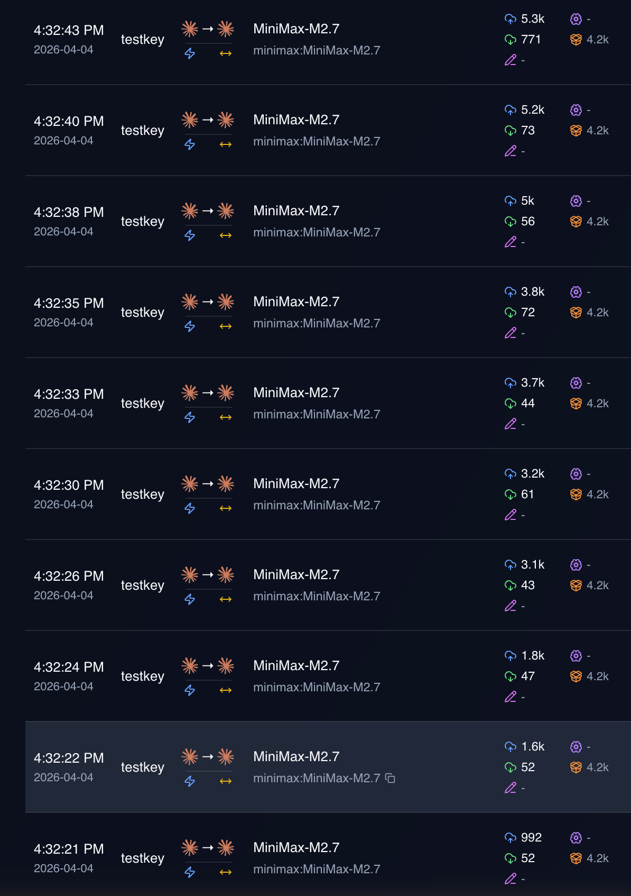
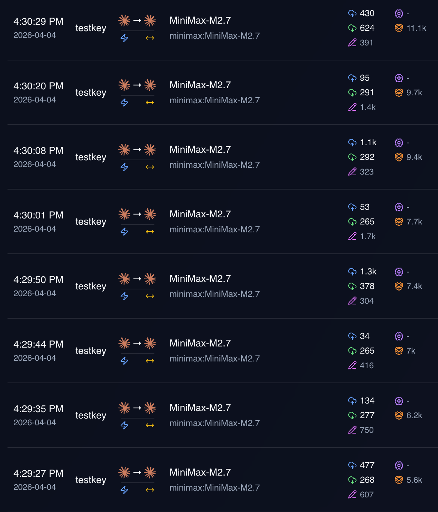

# pi-better-messages-cache

A [pi](https://github.com/badlogic/pi-mono) extension that implements the
**dual cache-breakpoint strategy** for Anthropic models, dramatically improving
prompt-cache hit rates on MiniMax, Kimi, and other Anthropic-compatible
providers.

> This implements the optimization proposed in
> [badlogic/pi-mono#1737](https://github.com/badlogic/pi-mono/pull/1737),
> which the upstream maintainer declined to merge into core.

---

## The problem

The built-in Anthropic provider marks the last *user* message block with
`cache_control`.  On some providers — notably **MiniMax** and **Kimi** — the
preceding assistant `tool_use` and `thinking` blocks sit *outside* the cached
window, so the cache must be re-read from scratch on almost every turn:

```
turn N
  [assistant]  thinking …          ← NOT cached ✗
               tool_use foo        ← NOT cached ✗
  [user]       tool_result foo     ← cache_control ✓  (only marker)

turn N+1
  The cache window starts at tool_result, missing the assistant blocks above.
```

## The fix

Mark **two** locations per turn:

| Location | Who marks it |
|---|---|
| Last **assistant** `tool_use` block | **This extension** (new) |
| Last **user** message block | Built-in provider (preserved) |

Both markers together ensure the full assistant turn (thinking + tool_use +
tool_result) sits inside the growing cached prefix on every subsequent call:

```
turn N
  [assistant]  thinking …
               tool_use foo  ← cache_control ✓  (marker 1 — NEW)
  [user]       tool_result foo  ← cache_control ✓  (marker 2 — existing)

turn N+1
  The cache window now covers the entire assistant turn above.
```

This dual-marking pattern aligns with the cache strategies used by
**OpenCode**, **Kilo Code**, and **Roo Code**.

### Empirical impact (from PR #1737 field data)

| Provider | Before | After |
|---|---|---|
| MiniMax / Kimi | near-zero cache hits | **80 %+ cache hit rate** |
| Anthropic native | baseline | small positive improvement |

#### Built-in pi caching — "cache hit wall" (MiniMax)



> **Note:** Notice the "cache hit wall" at ~4.2K cache hits — the orange cache-hit line flatlines, while the cache-miss line continues climbing.

#### With pi-better-messages-cache extension — drastically improved cache hits



> **Note:** Cache hits continue climbing throughout the session — the orange line no longer flatlines, achieving the dual cache-breakpoint strategy's intended behavior.

---

## How it works

`pi.registerProvider("anthropic", { api: "anthropic-messages", streamSimple })`
replaces the global api-registry entry for the `"anthropic-messages"` API type.
This transparently intercepts every model that uses that API — all native
Anthropic models — **without touching any model definitions, pricing, OAuth
config, or other settings**.

---

## Installation

```bash
# Global install (all projects)
pi install npm:pi-better-messages-cache

# Project-local install
pi install -l npm:pi-better-messages-cache
```

### Try without installing

```bash
pi -e npm:pi-better-messages-cache
```

### From git (latest unreleased)

```bash
pi install git:github.com/mcowger/pi-better-messages-cache
```

---

## Requirements

- [pi](https://github.com/badlogic/pi-mono) (any recent version)
- `@mariozechner/pi-coding-agent` and `@mariozechner/pi-ai` (bundled with pi,
  listed as `peerDependencies`)

---

## Uninstalling

```bash
pi remove npm:pi-better-messages-cache
```

This restores the built-in Anthropic stream handler automatically.

---

## License

MIT © mcowger
